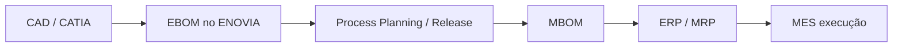

# Arquitetura 3DEXPERIENCE — referência sênior (seu projeto)

Documento de alinhamento técnico. Fonte: documentação DS, padrões ENOVIA REST, seu tenant e o código deste repositório.

---

## 1. O que você está construindo (escopo correto)

| Item | Definição |
|------|-----------|
| **Aplicação** | Dashboard HTML de analytics sobre **estrutura de produto** |
| **Fonte de dados** | **E-BOM** no **Product Structure Explorer** (engenharia) |
| **Consumidor** | Gestão / engenharia no **3DDashboard** (aba LISTA 3DX) |
| **Não é** | Substituto de ERP, MES, MBOM shop-floor, nem upload genérico de Excel |

O Product Explorer que você usa (`ENOSCEN_AP`, ENXScene no 3DSpace) trabalha com **definição de engenharia** — isso é domínio **EBOM**, não MBOM.

---

## 2. EBOM, MBOM, PBOM e ERP (linguagem certa)

| BOM | Dono típico | Perspectiva | No 3DEXPERIENCE |
|-----|------------|-------------|-----------------|
| **EBOM** | Engenharia / PLM | Como o produto **é projetado** (função, CAD, revisão) | Product Explorer, `dseng`, VPMReference, EngItem |
| **MBOM** | Manufatura | Como o produto **é fabricado** (sequência, embalagem, ferramentas) | Apps de manufatura, modeler **`dsmfg`**, Manufacturing Items |
| **PBOM** | Compras / planta (varia por empresa) | Visão **procurement / planta**; muitas vezes ligada ao plano de produção | Pode aparecer em fluxos DELMIA / ERP; não é o foco do Explorer de estrutura de desenho |

**Integração CAD ↔ PLM ↔ ERP (fluxo industrial padrão):**



- **Seu dashboard** encaixa em **EBOM + atributos ENOVIA** (antes do ERP).
- **ERP não lê GitHub**; consome MBOM/material master via integração batch/API (MID, X-CAD, serviços custom, etc.).
- Conectar “cad ERP ebom mbom pbom” no **mesmo HTML** só faz sentido se você definir **qual BOM** cada tela consome — misturar tudo num import Excel gera confusão (como a planilha de clientes que apareceu).

---

## 3. Serviços da plataforma (seu tenant)

| Serviço | Host no seu caso | Função |
|---------|------------------|--------|
| **3DDashboard** | `r1132100929518-us1-**ifwe**.3dexperience.3ds.com` | Shell de widgets, Compass, abas |
| **3DSpace / ENOVIA** | `r1132100929518-us1-**space**.3dexperience.3ds.com` | Dados PLM, REST, webapps (`/enovia/webapps/...`) |
| **3DPassport** | `iam.3dexperience.3ds.com` (cloud) | Login, SSO, tickets |
| **Product Explorer** | `.../enovia/webapps/ENXScene/ENXScene.html` | UI E-BOM (app `ENOSCEN_AP`) |

**Deep-link de objeto (documentado DS / 3DSwym):**

```
https://{ifwe-host}/#dashboard/app:{APP_ID}/content:X3DContentId={encodeURIComponent(JSON)}
```

JSON mínimo:

```json
{
  "data": {
    "items": [{
      "envId": "R1132100929518",
      "objectId": "<PHYSICAL_ID>",
      "objectType": "VPMReference"
    }]
  }
}
```

Apps citados pela DS para esse padrão: `ENOPSTR_AP` (Structure Editor), `ENXENG_AP`, `ENOWCHA_AP`. O Explorer usa conteúdo `3DXContent` no hash — **abrir** objeto é suportado; **exportar seleção para iframe externo** não é API pública documentada.

---

## 4. APIs REST que o projeto usa (dseng / dsxcad / dspfl)

Base (após login e CSRF no 3DSpace):

```
https://{space-host}/enovia/resources/v1/modeler/...
```

| Recurso | Uso no `enovia-api.js` |
|---------|-------------------------|
| `dseng/dseng:EngItem/{id}` | Raiz engenharia, expand BOM |
| `.../dseng:EngInstance` | Filhos da estrutura (lazy) |
| `dsxcad/dsxcad:VPMReference/{id}` | Alternativa raiz CAD/PLM |
| `dspfl/dspfl:PhysicalProduct/{id}` | Physical Product |
| `search` (federated) | Busca Physical Product |

**Autenticação no browser (widget confiável):**

- Módulo AMD: `DS/WAFData/WAFData` → `authenticatedRequest(url, { method, headers, onComplete })`
- Header **`SecurityContext`**: ex. `ctx::VPLMProjectLeader.Company Name.CS_IMPLANTACAO`
- Token **CSRF**: `GET .../resources/v1/application/CSRF`
- Resolução do space: `DS/i3DXCompassServices/i3DXCompassServices` → URL do serviço `3DSpace`

Documentação oficial (requer acesso Support DS):

- [Developer guides](https://www.3ds.com/support/documentation/developer-guides)
- Cloud doc hub: `media.3ds.com/.../DSDoc.htm` → **CAAiamREST**, **dseng_v1**, **Engineering Web Services**
- OpenAPI specs do resource library **3DSpace** (geração de cliente Swagger/Postman)

Repositórios de referência DS (exemplos de cliente REST):

- [3ds-cpe-emed/ws3dx-dotnet](https://github.com/3ds-cpe-emed/ws3dx-dotnet) — famílias `dseng`, `dsmfg`, etc.

---

## 5. Widgets: erro de arquitetura que explica “nada funciona”

Existem **dois modelos** diferentes. O projeto foi escrito para um; você implantou com outro.

| Modelo | Onde roda | `WAFData` / REST ENOVIA | Lê seleção do Explorer |
|--------|-----------|-------------------------|------------------------|
| **Additional App** | Domínio **confiável** do 3DDashboard (cadastro Platform Manager) | **Sim** | Possível (eventos / `require` / widget API) |
| **Web Page Reader** | **URL externa** (GitHub, qualquer HTTPS) em `<iframe>` | **Não** (cross-origin) | **Não** (sem API pública estável) |

Você está no **Web Page Reader** com URL GitHub ou 3DSpace.

- **GitHub** → bloqueio total de sessão ENOVIA.
- **3DSpace webapp** (`/enovia/webapps/BomAnalytics/`) → **correto** para REST + mesmo cookie de sessão **se** o usuário resolve DNS do `space` e o admin publicou o pacote.
- **Additional App** → alternativa se TI não puder publicar webapp, mas pode registrar widget no dashboard.

Referências:

- [PLM Coach – Widgets + WAFData](https://plmcoach.com/3dexperience-interview-questions/)
- [XLM – Widget fundamentals](https://xlmsolutions.com/blog/3dexperience-widget-fundamentals/)

**Conclusão sênior:** paste, drag JSON, Excel e “Carregar Drone” são **fallbacks de demonstração**, não arquitetura de integração PLM. O caminho industrial é **Additional App ou webapp 3DSpace**.

---

## 6. O que o repositório já implementa (bem alinhado à EBOM)

| Camada | Arquivos | Alinhamento |
|--------|----------|-------------|
| Platform | `context.js`, `compass.js`, `waf-client.js` | Padrão DS |
| REST | `enovia-api.js` | `dseng` / `dspfl` / `dsxcad` |
| BOM lazy | `bom-service.js` | EngInstance paginado |
| Explorer | `product-explorer-bridge.js`, `3dx-content-parser.js` | Deep-link + postMessage **best-effort** |
| Analytics | `metrics-engine.js`, `anomaly-detector.js` | KPIs / governança EBOM |
| UI | KPI, charts, tree, tabela Explorer | OK |

O código **não está errado** para EBOM; o **deploy e o tipo de widget** estão incompatíveis com o objetivo.

---

## 7. Caminhos válidos (escolher um — sem “atirar para todo lado”)

### A0 — **Additional App** (admin da plataforma, **sem** deploy 3DSpace) ← **seu caso**

Você é Platform Manager e só usa Web Page Reader hoje. O caminho DS é criar **Additional App** apontando para o **mesmo GitHub**:

→ **`GUIA-ADMIN-ADDITIONAL-APP.md`**

### A — Webapp no 3DSpace (quando TI publica no servidor)

1. Admin publica `webapps/BomAnalytics/`.
2. Widget **Web Page Reader** aponta para  
   `https://r1132100929518-us1-space.3dexperience.3ds.com/enovia/webapps/BomAnalytics/index.html`
3. Mesma aba: Explorer + Reader.
4. Dashboard chama `WAFData` e expande `dseng:EngInstance`.

**Bloqueio atual seu:** DNS do host `space` no PC → TI/VPN.

### B — Additional App (3DDashboard nativo)

1. Platform Manager registra o widget (código no domínio confiável).
2. `require(['DS/WAFData/WAFData', ...])` funciona no iframe do dashboard.
3. Integração com outros widgets via eventos UWA.

### C — Integração ERP / externo (se no futuro quiser MBOM + ERP)

1. **Serviço intermediário** (Java/.NET) com 3DPassport + REST `dseng` / `dsmfg`.
2. HTML (GitHub ou intranet) consome **sua** API, não ENOVIA direto.
3. MBOM e ERP ficam no backend com contrato de dados claro — fora do escopo do Web Page Reader puro.

---

## 8. O que parar de fazer

- Prometer BOM completa com `github.io` no Web Page Reader.
- Tratar import XLS / colar / drag como solução PLM.
- Novos botões sem corrigir **tipo de widget + DNS + publicação webapp**.
- Confundir lista comercial (clientes) com E-BOM do Drone.

---

## 9. Próximo passo único (decisão de arquitetura)

Responda internamente/TI:

1. **Conseguimos publicar `BomAnalytics` no 3DSpace e liberar DNS do `space`?** → seguir caminho **A**.
2. **Não, mas Platform Manager pode criar Additional App?** → caminho **B**.
3. **Precisamos ERP/MBOM no mesmo painel?** → caminho **C** (projeto fase 2, API intermediária + `dsmfg`).

---

## 10. Referências rápidas

| Tema | Link |
|------|------|
| Developer Assistance | https://www.3ds.com/support/documentation/developer-guides |
| EBOM (ENOVIA) | https://www.3ds.com/products/enovia/ebom |
| MBOM (ENOVIA) | https://www.3ds.com/products/enovia/mbom |
| BOM Management | https://www.3ds.com/products/enovia/bom-management |
| Deep-link 3DDashboard | https://3dswym.3dexperience.3ds.com/post/enovia-user-community/link-directly-to-an-object-in-3ddashboard_PzA_WXcdSd6imG-ShMU1qQ |
| Web services (visão) | https://plmcoach.com/3dexperience-web-services-guide/ |
| dseng REST (exemplo código) | https://github.com/3ds-cpe-emed/ws3dx-dotnet |

---

*Este documento é a base para próximas alterações. Qualquer código novo deve servir ao caminho A, B ou C — não a mais um fallback.*
