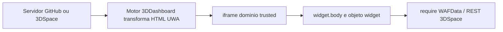
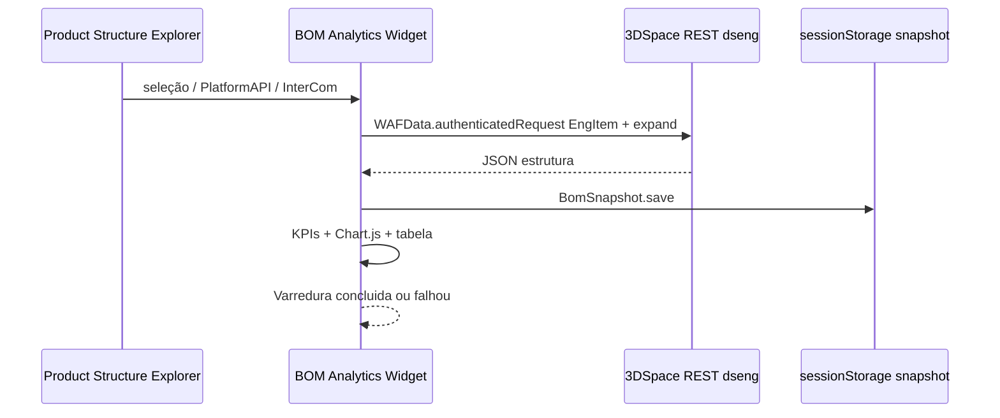

# Referência 3DEXPERIENCE PLM — BOM Analytics (parar tentativa e erro)

Documento único para retomar o projeto com base na **documentação Dassault** e no que **já foi provado** no tenant `R1132100929518` (SKA).

---

## 1. O que já está provado no seu ambiente

| Fato | Evidência |
|------|-----------|
| Additional App **Widget + Externo** funciona | `widget-min.html` mostrou **“widget UWA OK”** no 3DDashboard |
| GitHub Pages **funciona no Chrome** | `teste-url.html` verde; `widget-uwa.html` com botão Varrer no Chrome |
| Product Structure Explorer funciona | Mont10 / Drone na aba PRODUCTEXPLORE |
| Web Page Reader **não serve** para API ENOVIA | Documentação DS + testes anteriores |
| Deploy `/webapps/BomAnalytics/` | **Fora de escopo** — não há opção de publicar no 3DSpace neste projeto |
| Cache do dashboard | Mensagem antiga **“widget UWA OK”** ainda aparece → **cache 3DDashboard** ou URL antiga |

**Conclusão:** o problema **não** é “criar o app”. É **como** o HTML/JS deve ser escrito para o motor UWA do 3DDashboard e **como** obter a E-BOM (REST, não DOM).

---

## 2. Três formas oficiais de integrar HTML (Dassault)

Fonte: [Widget Dashboard Integration](https://library.plmcoach.com/caa3dx/win_b64.doc/English/CAAWebAppsJSRoot/CAAWebAppsTaWidgetIntegration.htm)

| Modo | Domínio no iframe | Acessa 3DSpace / WAFData? | Comunica com Explorer? | Uso BOM Analytics |
|------|-------------------|---------------------------|------------------------|-------------------|
| **Additional App** | **Trusted** (`3ddashboard…`) | **Sim** | Sim (pub/sub, PlatformAPI) | **Único caminho para API** |
| Run Your App | Untrusted | **Não** | Parcial | Não usar |
| Web Page Reader | Stand-alone, sem UWA | **Não** | **Não** | Só cola manual / demo |

**Regra:** administrador cria **Additional App**; usuário arrasta no dashboard. Não misturar com Web Page Reader na mesma aba.

---

## 3. Como o 3DDashboard carrega o widget (obrigatório entender)

Fonte: [Widget Principles](https://library.plmcoach.com/caa3dx/win_b64.doc/English/CAAWebAppsJSRoot/CAAWebAppsTaWidgetWriting.htm)



Pontos críticos:

1. **Servidor do widget** deve ser alcançável pelo **servidor do 3DDashboard** (cloud = URL pública, ex. `github.io`).
2. O HTML é **transformado**; a versão UWA embutida na plataforma **ignora** metadados UWA do seu arquivo.
3. Só o conteúdo em **`widget.body`** é a área visível do widget — **não** confiar no `document.body` da página hospedada.
4. Domínio final no browser é **3DDashboard trusted**, não `github.io` — por isso `WAFData` funciona no Additional App.

---

## 4. Template UWA oficial (o que a DS exige)

```xml
<?xml version="1.0" encoding="utf-8"?>
<!DOCTYPE html PUBLIC "-//W3C//DTD XHTML 1.0 Strict//EN" "...">
<html xmlns="http://www.w3.org/1999/xhtml" xmlns:widget="http://www.netvibes.com/ns/">
<head>
  <script type="text/javascript">
  //<![CDATA[
    function widgetLoading() {
      if (widget) {
        widget.body.innerHTML = '...';
        // iniciar require / WAFData aqui ou chamar função definida no mesmo bloco
      } else {
        setTimeout(widgetLoading, 100);
      }
    }
    widgetLoading();
  //]]>
  </script>
</head>
<body></body>
</html>
```

Padrão dos exemplos DS: [ds-3dx-custom-widget-samples](https://github.com/3ds-cpe-emed/ds-3dx-custom-widget-samples) — `widgetLoading()` + `setTimeout` até existir `widget`.

---

## 5. Regras DS que o nosso código violou (causa raiz do “branco”)

| Regra oficial | O que fizemos | Efeito |
|---------------|---------------|--------|
| **`widget` só em `<script>` inline no `<head>`** — não usar `widget` em arquivo `.js` externo | `widget-boot.js`, `app.js` acessam `widget.body` | Comportamento imprevisível / branco |
| **`body` vazio**; preencher `widget.body` | UI em `#app-shell` no `document.body` | Chrome vê; **3DDashboard não** |
| UWA **XHTML 1.0 Strict** + namespaces | HTML5 solto em algumas versões | Parser/transformação pode falhar |
| Carregar JS “como SPA” (15+ arquivos, `Promise`, bundle 130 KB) | `bom-bundle.js`, boot dinâmico | Motor antigo do dashboard pode quebrar o script inteiro |
| Obter BOM via **REST** `dseng` | “Varrer DOM” do Explorer | Não é padrão DS; fallback cola só |

Fonte explícita (Widget Principles): *“Do not use the widget object in an external JavaScript file”*.

**Por que `widget-min` funcionou:** um único script inline pequeno, só `widget.body.innerHTML = '...'`.

**Por que `widget-uwa` falhou no dashboard:** script maior, lógica externa, UI fora de `widget.body`, possível erro JS antes do `paint`.

---

## 6. Arquitetura correta para “varrer Mont10 → gráficos”

Não é “ler a grade do Explorer”. É:



### APIs (tenant SKA)

- **3DSpace:** `https://r1132100929518-us1-space.3dexperience.3ds.com/enovia`
- **Security context:** `ctx::VPLMProjectLeader.Company Name.CS_IMPLANTACAO`
- **Exemplo REST:**  
  `GET .../resources/v1/modeler/dseng/dseng:EngItem/{physicalId}?$expand=dseng:EngInstance`

### Módulos AMD (no iframe trusted)

```javascript
require([
  'DS/WAFData/WAFData',
  'DS/i3DXCompassServices/i3DXCompassServices',
  'DS/PlatformAPI/PlatformAPI'
], function (WAFData, Compass, PlatformAPI) { ... });
```

Fonte: [About Widget and HTTP Request](https://library.plmcoach.com/caa3dx/win_b64.doc/English/CAAWebAppsJSWS/CAAWebAppsTaDataAccess.htm)

### Seleção do Mont10

Ordem recomendada pela documentação / exemplos:

1. `DS/PlatformAPI/PlatformAPI` — objeto selecionado no dashboard  
2. Pub/sub entre widgets (`UWA/Utils/InterCom`) — artigo “Between Widgets”  
3. Deep link com `physicalid` na URL do dashboard  
4. **Fallback:** clipboard da grade (não é integração PLM; só contingência)

---

## 7. Cache do 3DDashboard (sua tela ainda mostra texto antigo)

Treinamento PLM Coach cita explicitamente: **“Deactivate 3DDashboard Cache”** ao desenvolver widgets.

Sintoma: Chrome mostra versão nova; dashboard mostra **“widget UWA OK”** antigo.

Ações (admin / dev):

1. Remover widget do dashboard → adicionar de novo  
2. Ctrl+F5 na aba  
3. ⋮ → Atualizar no widget  
4. Pedir ao admin desativar cache de widget em desenvolvimento (conforme doc formação DS)  
5. Trocar URL do app (ex. `widget-bom.html`) para forçar URL nova sem cache de conteúdo

---

## 8. Hospedagem (escopo deste projeto)

**Restrição confirmada:** publicar em **3DSpace `/webapps/` não é opção** — não trazer isso como caminho.

| Opção | Situação |
|-------|----------|
| **GitHub Pages** + **Additional App** | **Único caminho de deploy** para o widget |
| Servidor interno SKA (Azure/IIS) | Só se TI oferecer URL pública no futuro (não assumido) |

**Não usar** `cdn.jsdelivr.net` como URL do Additional App — no Chrome abre só código-fonte.

URL do widget:

```
https://mouraenderson.github.io/HTML-PRODUCT-EXPLORE/
```

---

## 9. Mapa do repositório (o que é o quê)

### Entradas widget (confuso hoje — simplificar na retomada)

| Arquivo | Papel | Status |
|---------|-------|--------|
| `widget-min.html` | Teste UWA mínimo | **Funciona no 3DDashboard** |
| `widget-uwa.html` | Entrada “produção” | Instável no dashboard |
| `widget-boot.js` | Boot externo | **Viola regra DS** (`widget` fora do inline) |
| `index.html` | Dashboard web completo | Chrome / demo; não é template UWA puro |
| `assets/js/bom-bundle.js` | Toda lógica concatenada | OK **depois** que UWA shell carregar |
| `assets/js/app.js` + serviços | Fontes do bundle | Manter; não carregar 20 scripts no UWA |

### Documentação

| Arquivo | Usar |
|---------|------|
| **Este arquivo** `REFERENCIA-3DX-PLM.md` | Fonte única |
| `SOLUCAO-PLM-PESQUISA.md` | Resumo APIs / admin |
| `URLS-3DX.md` | URLs corretas |
| `HABILITAR-GITHUB-PAGES.md` | Pages 404 |
| Outros guias | Histórico; não duplicar |

---

## 10. O que NÃO fazer na próxima fase

1. Mais variações de `widget-uwa` no escuro sem F12 no iframe do dashboard.  
2. Misturar Web Page Reader com expectativa de API.  
3. Colocar UI principal fora de `widget.body`.  
4. Usar `widget` em `widget-boot.js`, `app.js` carregado antes do shell UWA.  
5. Aumentar bundle / `Promise` no HTML inline do UWA.  
6. Assumir que Chrome = 3DDashboard (são ambientes diferentes).  
7. “Varrer” DOM do iframe do Explorer como solução principal.

---

## 11. Plano único quando retomar (sem tentativa e erro)

### Fase 0 — Diagnóstico (30 min, uma vez)

1. Additional App URL = `widget-min.html` com **versão visível** no texto (ex. `OK v2026-05-29`). Se não atualizar → resolver **cache** com admin.  
2. F12 no **iframe** do widget no 3DDashboard (menu desenvolvedor do browser na página do dashboard). Copiar erros Console.  
3. Confirmar tipo **Widget** + **Externo** + objetos `VPMReference…`

### Fase 1 — Shell UWA conforme DS (1 arquivo)

Criar **`widget-bom.html`** (URL nova):

- XHTML 1.0 Strict + `widgetLoading()`  
- Todo uso de `widget` **só no inline `<head>`**  
- `widget.body.innerHTML` = UI mínima (status + botão Varrer)  
- `require(WAFData…)` no **mesmo inline**, callbacks (sem `Promise`)  
- **Um** script externo permitido: `bom-bundle.js` carregado **depois** via `onload` de tag criada no inline, sem tocar `widget` dentro do bundle — bundle usa só `document.querySelector` dentro de `widget.body`

Tudo no **GitHub Pages**; shell UWA conforme DS.

### Fase 2 — Varredura + entrega

1. Seleção Mont10 → REST `dseng` → `BomSnapshot` → gráficos.  
2. Botão Varrer → mensagem **Varredura concluída** / **Varredura falhou**.  
3. Critério de aceite: N > 1 itens do Mont10 no dashboard.

---

## 12. Referências oficiais (estudar nesta ordem)

1. [Widget Dashboard Integration](https://library.plmcoach.com/caa3dx/win_b64.doc/English/CAAWebAppsJSRoot/CAAWebAppsTaWidgetIntegration.htm) — Additional App vs Run Your App vs Web Page Reader  
2. [Widget Principles](https://library.plmcoach.com/caa3dx/win_b64.doc/English/CAAWebAppsJSRoot/CAAWebAppsTaWidgetWriting.htm) — `widget.body`, template, trusted  
3. [About Widget and HTTP Request](https://library.plmcoach.com/caa3dx/win_b64.doc/English/CAAWebAppsJSWS/CAAWebAppsTaDataAccess.htm) — WAFData  
4. [Widget and Resources Loading Principles](https://library.plmcoach.com/caa3dx/win_b64.doc/English/CAAWebAppsJSRoot/CAAWebAppsTaWidgetResourceLoading.htm) — como referenciar JS/CSS  
5. [GitHub 3ds-cpe-emed/ds-3dx-custom-widget-samples](https://github.com/3ds-cpe-emed/ds-3dx-custom-widget-samples)  
6. [custom-widget-update-prop](https://github.com/3ds-cpe-emed/custom-widget-update-prop) — index.html + main.js + WAFData  
7. [3DSpace Engineering Web Services (dseng)](https://media.3ds.com/support/documentation/developer/Cloud/en/English/3DSpaceWS/dseng.htm) — REST BOM  
8. Formação PLM Coach — tópicos: *Deactivate 3DDashboard Cache*, *Between Widgets*, *Calling Web-Service from Widget*

---

## 13. Resumo em uma frase

**BOM Analytics no 3DDashboard = Additional App + HTML UWA mínimo inline em `widget.body` + WAFData/dseng no 3DSpace; o repositório atual tem lógica certa no `bom-bundle`, mas a entrada UWA foi feita como site web, não como widget Dassault — por isso Chrome ok e dashboard branco/cache.**

Quando quiser retomar: **Fase 0** (cache + F12) → **Fase 1** (`widget-bom.html` no GitHub, padrão DS). Sem 3DSpace.

**Ao retomar o agente:** não sugerir deploy em `/enovia/webapps/` — fora de escopo neste projeto.
