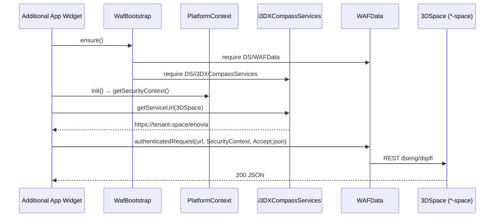

# Auditoria — Arquitetura de Plataforma e Integração (HTTP 404 / 406)

**Data:** 2026-06-07  
**Repositório:** [MouraEnderson/HTML-PRODUCT-EXPLORE](https://github.com/MouraEnderson/HTML-PRODUCT-EXPLORE)  
**Plataforma alvo:** 3DEXPERIENCE R2026x / FD02  
**Runtime alvo:** Additional App nativo no 3DDashboard (sem Web Page Reader)

---

## 1. Objetivo

Identificar e corrigir falhas arquiteturais nas camadas **platform** e **integration** que causam erros **HTTP 404** e **406** ao consumir APIs nativas ENOVIA/3DSpace a partir do widget BOM Analytics.

Esta auditoria foi executada sobre o workspace local completo antes de qualquer alteração de código.

---

## 2. Regras obrigatórias (documentação oficial DS)

| # | Regra | Consequência se violada |
|---|-------|-------------------------|
| 1 | **IAM / WAFData:** toda requisição via `DS/WAFData/WAFData.authenticatedRequest` com header `SecurityContext` resolvido dinamicamente; `Accept` / `Content-Type` / `type` corretos por endpoint | **406 Not Acceptable** |
| 2 | **Isolamento de URLs:** host IFWE (3DDashboard) **não** é base de 3DSpace; URL obtida via `DS/i3DXCompassServices/i3DXCompassServices.getServiceUrl({ serviceName: '3DSpace' })` | **404 Not Found** |
| 3 | **Runtime:** app como Additional App inline no widget — APIs locais da plataforma, sem deploy externo administrativo | fallbacks incorretos, WAF indisponível |

---

## 3. Passo 1 — Inventário de arquivos para correção

### 3.1 Camada `assets/js/platform/` (6 arquivos)

| Arquivo | Prioridade | Motivo |
|---------|------------|--------|
| `compass.js` | **Crítica** | Resolução de URL com fallbacks estáticos e caminho IFWE→`/enovia` |
| `waf-client.js` | **Crítica** | Retry IFWE↔space, headers IAM incompletos em alguns métodos |
| `platform-bridge.js` | **Alta** | `getSpaceUrl()` monta URL estática sem Compass |
| `context.js` | **Média** | `SecurityContext` estático de `TENANT_DEFAULTS` quando PlatformAPI falha |
| `waf-bootstrap.js` | Baixa | Correto — carrega WAFData + Compass via `require` |
| `widget-runtime.js` | Baixa | Correto — marca Additional App trusted |

### 3.2 Camada `assets/js/integration/` (6 arquivos)

| Arquivo | Prioridade | Motivo |
|---------|------------|--------|
| `enovia-api.js` | **Alta** | `defaultSpaceUrl()` usa `spaceHost` estático / hostname IFWE |
| `search-api.js` | Baixa | Depende de `spaceUrl` inicializado upstream |
| `3dplay-bridge.js` | Média | `platformOrigin()` e `contextId` estáticos (postMessage, não REST) |
| `explorer-context.js` | Baixa | Sem construção de URL de API |
| `product-explorer-bridge.js` | Baixa | DOM/postMessage apenas |
| `3dx-content-parser.js` | Baixa | Parser de deep-link — sem violação direta |

### 3.3 Consumidores downstream (fora de platform/integration)

| Arquivo | Prioridade | Motivo |
|---------|------------|--------|
| `services/explorer-scanner.js` | **Crítica** | `ensureSpaceApi()` chama `fastConnectIfwe`, `ifweSpaceUrl`, `PlatformBridge.getSpaceUrl` |
| `services/api-bom-loader.js` | Média | Delega para `ExplorerScanner.ensureSpaceApi()` |
| `services/api-diagnostic.js` | Média | Detecta IFWE mas não corrige; referência para validação pós-fix |
| `ui/part-image.js` | **Alta** | `buildGetPictureUrl()` aponta para IFWE `/enovia/resources/getpicture` → 404 |
| `config.js` | **Alta** | `TENANT_DEFAULTS.platformHost/spaceHost` alimentam todos os fallbacks |
| `widget-boot.js` | Baixa | Boot WAF/Compass correto; ainda referencia bundle GitHub (legado Web Page Reader) |

> **Nota:** os arquivos `assets/js/bom-bundle*.js` espelham os mesmos problemas. Após corrigir os fontes, executar rebuild via `scripts/build-bundle.ps1`.

---

## 4. Passo 2 — Diagnóstico por violação

### 4.1 Regra 1 — IAM / WAFData

| Arquivo | Linhas | Violação |
|---------|--------|----------|
| `waf-client.js` | 96–104 | Em GET, headers reconstruídos parcialmente — `SecurityContext` pode faltar se `PlatformContext` não estiver pronto |
| `waf-client.js` | 144 | `type: 'json'` fixo — respostas não-JSON geram **406** |
| `waf-client.js` | 160–179 | Retry automático trocando host space↔IFWE mascara erro real |
| `context.js` | 121–133, 147–156 | Fallback estático `TENANT_DEFAULTS.securityContext` sem resolver via `PlatformAPI.getSecurityContext()` |
| `enovia-api.js` | 142–145 | POST com headers duplicados (`Accept`/`Content-Type`) sobrepostos ao merge do WafClient |
| `ui/part-image.js` | 143–146 | `getpicture` com `type: 'json'` para resposta binária → **406** |

### 4.2 Regra 2 — Isolamento de URLs (IFWE ≠ 3DSpace)

| Arquivo | Linhas | Violação |
|---------|--------|----------|
| `compass.js` | 32–35 | `ifweSpaceUrl()` = `platformHost + /enovia` — usa IFWE como 3DSpace |
| `compass.js` | 101–103, 126–134 | `fastConnectIfwe()` bypassa Compass quando dashboard está no IFWE |
| `compass.js` | 191–197 | `get3DSpaceUrl()` retorna IFWE **antes** de chamar `i3DXCompassServices` |
| `compass.js` | 209–231, 239–261 | Fallback para `tenantSpaceUrl()` estático se Compass falhar/timeout |
| `platform-bridge.js` | 39–42 | `getSpaceUrl()` = `https://{spaceHost}/enovia` sem Compass |
| `waf-client.js` | 23–33, 48–67 | `ifweRetryUrl()` / `swapSpaceIfwe()` — troca hosts estáticos |
| `enovia-api.js` | 16–23 | `defaultSpaceUrl()` usa `spaceHost` estático |
| `explorer-scanner.js` | 367–402 | Cadeia: `fastConnectIfwe` → `tenantSpaceUrl` → `ifweSpaceUrl` |
| `ui/part-image.js` | 76–77 | Thumbnail via IFWE `/enovia/resources/getpicture` |
| `config.js` | 245–246 | Hosts hardcoded alimentam toda a cadeia de fallback |

### 4.3 Regra 3 — Runtime Additional App

| Arquivo | Linhas | Observação |
|---------|--------|------------|
| `widget-boot.js` | 8–10 | Ainda referencia GitHub Pages + bundle remoto (legado iframe) |
| `config.js` | 359–372 | `IFRAME_ON_IFWE_DASHBOARD` ativa caminhos IFWE específicos para iframe externo |
| `compass.js` | 203–206 | `PlatformBridge.getSpaceUrl()` usado em widget externo — bypass Compass |

### 4.4 Causa raiz

A arquitetura foi desenhada para suportar widget em **GitHub iframe** no 3DDashboard IFWE, com fallbacks estáticos `*-ifwe` e `*-space`. No **Additional App nativo** R2026x:

- **404:** endpoint REST chamado no host IFWE (`…-ifwe…/enovia/…`) em vez do 3DSpace resolvido pelo Compass (`…-space…/enovia/…`).
- **406:** combinação de headers/`type` incorretos, `SecurityContext` desatualizado ou estático, e retry que mascara o endpoint errado.

---

## 5. Plano de sprints e etapas de correção

### Sprint A — Resolução dinâmica de URL via Compass (elimina 404)

**Objetivo:** toda URL de 3DSpace vem exclusivamente de `i3DXCompassServices.getServiceUrl({ serviceName: '3DSpace' })`.

| Etapa | Ação | Arquivos |
|-------|------|----------|
| A.1 | Remover `ifweSpaceUrl()`, `fastConnectIfwe()`, candidatos IFWE em `spaceUrlCandidates()` | `compass.js` |
| A.2 | Reescrever `get3DSpaceUrl()`: Compass first, sem fallback estático; rejeitar URL contendo `-ifwe` | `compass.js` |
| A.3 | `PlatformBridge.getSpaceUrl()` delegar para `CompassServices.getVerifiedSpaceUrl()` ou Promise Compass | `platform-bridge.js` |
| A.4 | Remover fallbacks estáticos em `ensureSpaceApi()` | `explorer-scanner.js` |
| A.5 | `defaultSpaceUrl()` usar apenas cache Compass verificado | `enovia-api.js` |
| A.6 | `buildGetPictureUrl()` usar URL 3DSpace do Compass (`/resources/getpicture`) | `ui/part-image.js` |

**Critério de aceite:** `api-diagnostic.js` → linha "3DSpace verificado" = OK, host `*-space.3dexperience.3ds.com/enovia`, nunca `*-ifwe`.

---

### Sprint B — IAM / WAFData limpo (elimina 406)

**Objetivo:** toda requisição REST passa por `WAFData.authenticatedRequest` com headers corretos.

| Etapa | Ação | Arquivos |
|-------|------|----------|
| B.1 | Unificar merge de headers: sempre `PlatformContext.getHeaders()` + override por método | `waf-client.js` |
| B.2 | Remover `ifweRetryUrl()`, `swapSpaceIfwe()`, `normalizeRequestUrl()` IFWE | `waf-client.js` |
| B.3 | Parametrizar `type`/`responseType`: `json` para REST modeler; `text`/binary para CSRF/getpicture | `waf-client.js`, `part-image.js` |
| B.4 | Bloquear request se `SecurityContext` não resolvido (exceto DEMO_MODE) | `waf-client.js`, `context.js` |
| B.5 | Resolver `SecurityContext` via cadeia: `widget.wafSecurityContext` → `PlatformAPI.getSecurityContext()` → deep-link; sem fallback estático em Additional App | `context.js` |
| B.6 | Remover headers duplicados nos POST de `enovia-api.js` (confiar no WafClient) | `enovia-api.js` |

**Critério de aceite:** CSRF + `dseng:EngItem/{id}` retornam 200 via WAF; zero retry IFWE nos logs `__3DX_API_DIAG__`.

---

### Sprint C — Runtime Additional App nativo

**Objetivo:** app roda inline no 3DDashboard sem dependência de GitHub/iframe.

| Etapa | Ação | Arquivos |
|-------|------|----------|
| C.1 | Garantir boot via `widget-runtime.js` + `waf-bootstrap.js` antes de qualquer API call | `app.js`, boot |
| C.2 | Desativar flags legadas: `ALLOW_IFWE_AS_3DSPACE`, `SPACE_FALLBACK_VIA_IFWE`, paths IFWE em trusted runtime | `config.js` |
| C.3 | `detectRuntimeMode()`: Additional App trusted → `CAN_USE_ENOVIA_API=true`, sem side-effects IFWE para iframe | `config.js` |
| C.4 | Rebuild bundle: `scripts/build-bundle.ps1` → novo BUILD | deploy |
| C.5 | Validar no dashboard piloto com `api-diagnostic` + carga BOM real | teste manual |

---

### Sprint D — Validação e deploy

| Etapa | Ação |
|-------|------|
| D.1 | Rodar diagnóstico isolado (`api-diagnostic.js`) no widget Additional App |
| D.2 | Testar fluxo: Explorer → seleção Mont10 → API lazy BOM |
| D.3 | Confirmar KPIs ≠ 0 após import ou API (sem depender de snapshot) |
| D.4 | Commit + PR + deploy `deploy.ps1` com novo BUILD tag |

---

## 6. Fluxo alvo (pós-correção)

---

## 7. O que fazer primeiro (recomendação)

### Ordem recomendada

1. **Sprint A — `compass.js`** (maior impacto nos 404)  
   Remover caminhos IFWE e fallbacks estáticos; Compass como única fonte de URL 3DSpace.

2. **Sprint A — `explorer-scanner.js` + `enovia-api.js`**  
   Alinhar consumidores à nova API do Compass (sem `fastConnectIfwe` / `tenantSpaceUrl`).

3. **Sprint B — `waf-client.js` + `context.js`**  
   Headers IAM unificados, `SecurityContext` dinâmico, remover retry IFWE.

4. **Sprint B — `part-image.js`**  
   Corrigir `getpicture` (URL space + `type` binário).

5. **Sprint C — rebuild bundle + deploy**  
   Gerar novo BUILD e publicar no tenant piloto.

6. **Sprint D — validação**  
   Usar painel de diagnóstico API e fluxo Mont10 no dashboard LISTA 3DX.

### Quick wins imediatos (sem refactor completo)

| Ação | Efeito esperado |
|------|-----------------|
| Confirmar widget como **Additional App** (não Web Page Reader GitHub) | WAFData + Compass disponíveis no `require` do dashboard |
| Verificar `SecurityContext` no widget (`widget.wafSecurityContext`) | Reduz 406 por contexto errado |
| Rodar diagnóstico API no widget (`?debug=1` se exposto) | Evidência objetiva de URL IFWE vs space |
| Manter import Ctrl+C como contingência | KPIs funcionam enquanto API é corrigida |

### O que NÃO fazer

- Não usar `*-ifwe.3dexperience.3ds.com/enovia` como base REST.
- Não habilitar `ALLOW_IFWE_AS_3DSPACE: true` no Additional App nativo.
- Não tratar retry IFWE↔space como solução permanente.
- Não depender de `TENANT_DEFAULTS.spaceHost` em produção quando Compass está disponível.

---

## 8. Referências cruzadas

- [Plano de sprints priorizado](PLANO-SPRINTS-PRIORIZADO.md) — Prioridade 1 (Diagnóstico API isolado)
- [Sprint 01 - Diagnóstico API](SPRINT-01-DIAGNOSTICO-API.md)
- [Sprint 01.1 - WAF/modeler](SPRINT-01-1-WAF-MODELER.md)
- [Auditoria de código](AUDITORIA-CODIGO.md)
- [Decisões técnicas](DECISOES-TECNICAS.md)

---

## 9. Status

| Item | Status |
|------|--------|
| Auditoria platform/integration | ✅ Concluída (2026-06-07) |
| Documentação | ✅ Este documento |
| Implementação Sprint A | ⏳ Pendente |
| Implementação Sprint B | ⏳ Pendente |
| Implementação Sprint C/D | ⏳ Pendente |

---

*Gerado por auditoria automatizada do workspace HTML-PRODUCT-EXPLORE — branch de documentação.*
