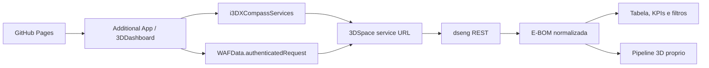

# Plano Tecnico - Fase 0

Data: 2026-06-03

## Objetivo

Congelar o direcionamento tecnico do produto antes de iniciar sprints de implementacao. Esta fase nao muda logica de carregamento, nao atualiza dependencias e nao remove arquivos sem aprovacao explicita.

## Escopo oficial do produto

O produto sera uma aplicacao HTML/JS publicada por GitHub Pages e executada dentro do 3DDashboard como Additional App.

Fluxo aprovado:

- GitHub Pages como origem dos arquivos estaticos.
- Additional App no 3DDashboard como runtime.
- WAFData para chamadas autenticadas.
- i3DXCompassServices para resolver a URL correta do 3DSpace.
- 3DSpace REST para dados ENOVIA/E-BOM.
- Visualizador 3D proprio dentro da aplicacao.

Fora do escopo do produto:

- Web Page Reader.
- Deploy admin em webapps da plataforma 3DX.
- Widget 3DPlay como solucao de visualizacao.
- Ctrl+A/Ctrl+C como fluxo principal de carga.

## Arquitetura alvo

## Gaps tecnicos conhecidos

- Muitos erros 404/406 no console ao carregar estrutura.
- O codigo ainda tem risco de tratar host IFWE como 3DSpace.
- A carga E-BOM usa cascata de endpoints incompativeis em alguns cenarios.
- Estruturas maiores podem carregar parcialmente, como o caso de 79 itens.
- O fallback manual por Ctrl+A/Ctrl+C ainda e usado como paliativo.
- `getpicture` gera tempestade de 404 e nao deve fazer parte do sucesso da carga E-BOM.
- O preview atual nao renderiza modelo 3D real no painel proprio da aplicacao.
- Limites funcionais de quantidade de itens nao podem existir como criterio de produto.

## Direcao tecnica recomendada

1. Corrigir a resolucao da base URL do 3DSpace.
2. Reescrever a carga E-BOM como API-first usando dseng.
3. Manter fallback manual apenas como contingencia.
4. Separar miniatura, estrutura e 3D em pipelines independentes.
5. Criar pipeline 3D proprio com resolucao de objeto, representation/derived output, download por ticket quando permitido e renderizacao com Three.js.
6. Criar criterios de aceite baseados nos quatro casos reais informados.

## Criterios de aceite iniciais

- Caso 79 itens: carregar estrutura completa, sem parcial silencioso.
- Caso 20 itens: carregar estrutura completa.
- Caso 3 itens: carregar estrutura completa.
- Caso 1 item com 2 corpos: representar corretamente os corpos/representacoes.
- Console sem tempestade de 404/406.
- Erro de miniatura nao bloqueia E-BOM.
- Fallback manual continua disponivel como resgate.
- Clique em item da E-BOM exibe estado claro do viewer: carregando, renderizado, indisponivel ou erro.

## Entregaveis da Fase 0

- Levantamento tecnico atual documentado.
- Escopo correto congelado.
- Mapa de arquivos ativos, legados e candidatos a remocao.
- Plano seguro de organizacao do repositorio.
- Backlog inicial por sprints.

## Observacoes de seguranca

Foram encontrados dominios e tenant da plataforma 3DX em codigo e documentacao. Nao foi identificado segredo em claro nesta varredura inicial. Tokens de CSRF aparecem como nomes de variaveis e fluxo de runtime, nao como valores fixos.
